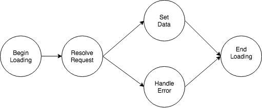

# Redux-Rags
[](https://www.npmjs.com/package/redux-rags)
[](https://www.npmjs.com/package/redux-rags)
[](https://bundlephobia.com/result?p=redux-rags)
[](https://bundlephobia.com/result?p=redux-rags)

Redux Reducers, Actions, and Generators: Simplified!

Generate and automatically inject reducers that manage the `begin load -> load -> endLoad -> set data || set error` lifecycle for data fetching.

TLDR: `({ load }) => ({ actions: { load }, getters: { getData } })`

## Motivation
We found that a lot of our reducers were redefining a common theme. We have some endpoint
that we want to query for data. So we'll want a `begin loading` action, so we can render
a fancy loading spinner. Then we'll hit the endpoint, maybe it returns data, maybe we get
an error. But we definitely stopped loading. And that's it. A mini-state machine that we
redefined dozens of times. Repeating this pattern over and over again, re-creating similar
Actions and Subreducers.

<center>
  
</center>


But what if there were an easier way? What if we could define
that mini state machine once and re-use the logic with each query? Well `redux-rags` is
here to help clean up all the spilled copy-pasta from your redux boilerplate!

Huge thanks to Jimmy Shen for [this amazing Medium article](https://medium.com/@jimmy_shen/inject-reducer-arbitrarily-rather-than-top-level-for-redux-store-to-replace-reducer-fdc1060a6a7)
on dynamically injecting reducers into the redux store.

## Usage

### Let's define our redux interactions in a separate file
Here's how you'd interact with redux for a data request. We're going to create the actions and
automatically create and inject the subreducer. The returned `load` function will take the same
arguments as the `load` function passed in.
```js
import { ragFactory } from 'redux-rags';

const { actions: { load }, getters: { getData, getIsLoading } } =
  ragFactory({ load: () => axios.get('/faq') });

export {
  loadFaq: load,
  getFaq: getData,
  getIsFaqLoading: getIsLoading
};
```

#### Use that Data Request in a React Component
Import the Getters and Action as you normally would and use them with `react-redux`.
```js
import React from 'react';
import { connect } from 'react-redux';
import { loadFaq, getFaq, getIsFaqLoading } from './faqData';
import Loading from './Loading';
import FaqItem from './FaqItem';

class Faq extends React.Component {
  componentDidMount() {
    this.props.loadFaq();
  }

  render() {
    const { isLoading, faqData } = this.props;
    if (isLoading) {
      return <Loading />;
    }

    return (
      <React.Fragment>
        {faqData.map((data, index) => <FaqItem key={index} data={data} />}
      </React.Fragment>
    )
  }
}

const mapStateFromProps = state => ({
  faqData: getFaq(state),
  isLoading: getIsFaqLoading(state)
});

export default connect(mapStateFromProps, { loadFaq })(Faq);
```

And that's it! That's all you need to do, no need to handle creating or placing a subreducer
anywhere, that's all being handled behind the scenes for you. The subreducer is a pretty basic
one, it just holds the return of `load` in the data attribute and keeps track of some meta
information. If you want to adjust how you're calling load based on the meta data, like delaying
or debouncing the request, you can define those interactions yourself using the meta data.

If you want to keep track of data by parameters passed to `load`, i.e. loading a whole bunch
of users, you'll want to use `ragFactoryMap`. This will use `ragFactory` behind the scenes to
create the simple mini-reducer for each set of parameters you specify.


## Pre Requisites
You'll need `redux-thunk` and to restructure your `createRootReducer` function. We'll
need to handle the addition of dynamic reducers!

Here's what your redux store creation will look like:
```js
import { combineReducers, createStore, applyMiddleware } from 'redux';
import thunk from 'redux-thunk';

import { combineAsyncReducers, configureRags } from 'redux-rags';

// ... import a few reducers, we'll use userReducer as an example
import userReducer from './userReducer';

const createRootReducer = (dynamicReducers: Object = {}) => {
  dynamicReducers = combineAsyncReducers(combineReducers, dynamicReducers);

  return combineReducers({
    ...dynamicReducers,
    // Then list your reducers below
    userReducer
  });
}

const middleware = applyMiddleware(thunk);
const store = createStore(createRootReducer(), compose(middleware));
configureRags(store, createRootReducer);
```

## What Actions and Getters are there?
Getters take in the full store as the argument. For `ragFactory`, you'll have access to the following getters:

- `get`: Returns `BoilerState<T>`, so an object that looks like `{ data, meta }`.
- `getData`: Returns the `data` attribute from `BoilerState<T>`. It would be type `?T`, whatever your load / update functions passed to the `ragFactory` return.
- `getMeta`: Returns the `meta` attribute from `BoilerState<T>`. This will be an object that looks like `{ loading, lastLoadTime, errors }`, with a few more properties. Look for the types / additional properties in the type definition.
- `getIsLoading`: Returns the `loading` attribute from the `meta` field. A common use case is for quick access to the loading state, so a special getter is provided for this meta attribute.

Actions are implementations of commonly used features to manipulate the state. Most of these are action creators, with `load` and `update` being thunks.

- `beginLoading`: Sets `loading` meta property to true.
- `endLoading`: Sets `loading` meta property to false.
- `reset`: Returns the subreducer to the initial state.
- `errors`: Sets the errors meta value.
- `clearErrors`: Clears the errors meta value.
- `updateData`: Sets the data value for the subreducer.
- `update`: Thunk. Calls the `update` function passed in to `ragsFactory` and sets the data value to the result. Might also set the error attribute if the `update` function throws an error.
- `load`: Thunk. Calls the appropriate sequence of `beginLoading`, `updateData`, `endLoading` actions while calling the `load` function passed to `ragsFactory`. If there are errors while executing, the error meta value will be set.

## Details and explanations of exports

### A few types to consider:
The generated subreducer uses the following type for the state:
```js
type BoilerState<T> = {
  data: ?T,
  meta: {
    loading: boolean,
    loaded: boolean,
    changeCount: number,
    lastChangeTime: ?number,
    errors?: *
  }
}
```
|  Meta Property | Description |
|:----:|:---:|
| loading | Is the data currently being loaded |
| loaded | Has the data every been loaded? Equivalent to `changeCount > 0` |
| changeCount | Number of times the data has been loaded / updated |
| lastChangeTime | The time of the last change |
| errors | Error object from the `load` or `update` function, if any |

### configureRags
Signature: `(store: Object, createRootReducer: Function) => void`.

This function is how you set up the module, giving it access to your redux store. This is used to configure the reducer
injector. We need `store` for the [`replaceReducer`](https://redux.js.org/api/store#replaceReducer) method. And we'll need to have a formatted `createRootReducer` function that accepts dynamic reducers. We've provided a `combineAsyncReducers` function to make this easier.

### combineAsyncReducers
Signature: `(combineReducers: Function, dynamicReducers: Object) => newDynamicReducers`

This function is designed to recursively call the `combineReducers` function on the second parameter `dynamicReducers`. This means that whatever the structure of `dynamicReducers` we can register the functions with `redux`. The package internally will add values underneath `@@redux-rags` and `@@redux-rags/map` keys in the `dynamicReducers` object. 

### injectReducer
Signature: `(keys: Array<string>, reducer: Function) => void`

This function will insert the given `reducer` at the nested key location in `dynamicReducers` specified by `keys`. For example, if the user has called `ragFactory` with the name `'user info'` internally we will call this function with `injectReducer(['@@redux-rags', 'user info'], subreducer)`. This will set values so that `dynamicReducers['@@redux-rags']['user info'] == subreducer` and update the store with the newly injected subreducer.

You can call this function and inject your own subreducers. You could just use `configureRags`, `combineAsyncReducers`, and `injectReducer` to setup your store to allow for dynamic reducers and skip the rest of this module. 

### ragFactory

Though both `load` and `update` are optional, you pass at least one. With neither of these, there is no good way to
update the data or metadata fields.

The `ragFactory` will place the dynamically added subreducers in the `@@redux-rags` top leve of the redux store.
If you want to place this somewhere else, just put the returned `subreducer` somewhere in your redux store and
pass in the `getInStore` function.

|  Props  |  Type  |  Optional  |  Description  |
|:-------:|:------:|:----------:|:-------------:|
| name | string | yes | A string that identifies the data. If you pass a name, the actions sent to redux and the automatically injected subreducer will use that name. |
| load | Function | yes | A function that loads data |
| getInitialState | Function | yes | Function to create initial data for the return of `load`, will use null if not defined |
| getInStore | Function | yes | `(state) => state.some.path.to.subreducer` Function to locate the subreducer in the store. Will place in default location if not specified, otherwise will use this location in getters. |
| update | Function | yes | (dataValue, ...args) => { return newData; } A function to manipulate the data attribute. Returned `update` will have signature `(...args) => void` |
| loadOnlyOnce | boolean | yes | Prevent the `load` function from being called more than once. |
| partialReducer | Function | yes | Allows you to hook in to other actions in the redux store and modify the state. You'll be working with the BoilerState argument. Extend the reducer and listen to other actions, for example you can could clear the data on user logout. Write this like a reducer to extend the functionality of the generated boilerplate. You can also delay assignment if you want to utilize actions in the returned Actions object, just assign the function to `subreducer.partialReducer`.|

### ragFactoryMap
What's this `ragFactoryMap`? Well if you want to cache data based on the query parameters, then the `ragFactoryMap` is for you!
For each collection of args, a new reducer will be injected. The params are stringified and used as the key for the injected subreducer.

The `ragFactoryMap` builds on top of `ragFactory`. That factory is used internally to generate the subreducers and actions for each key.

| Props | Type | Optional | Description |
|:-----:|:----:|:--------:|:-----------:|
| name | string | yes | A string that identifies the data. If you pass a name, the actions sent to redux and the automatically injected subreducer will use that name. |
| load | Function | no | A function that loads data. The returned function will have the same signature. |
| getInitialState | Function | yes | Function to create initial data for the return of load, will use null if not defined |


## Additional Examples

### Single File Redux Connection Example
Here we want to hit an endpoint with the `userId` parameter. We'll avoid worrying about
loading states or anything for now. The call to `ragFactory` creates the actions and injects
the subreducer for us. Then this state information is stored in redux, so when users return to the
component they'll see the cached data. [Play with a similar example on CodeSandbox](https://codesandbox.io/s/vnn9pnp6vl)

```js
import React from 'react';
import { connect } from 'react-redux';
import { ragFactory } from 'redux-rags';

// Pass load to factory, factory returns a load that we can give to redux, will have the same signature as the function we passed in.
const { actions: { load }, getters: { getData } } = ragFactory(
  load: (userId) => axios.get('/users', { userId })
});

function ViewUser({userId, load, user}) {
  return (
    <div>
      <button onClick={() => load(userId)}>Load User Info</button>
      {user && <UserData data={user} />}
    </div>
  )
}

export default connect(state => ({ user: getData(state)}), { load })(ViewUser)
```

### Placing the subreducer in a custom location in redux
Connect subreducer to your desired location in the redux store, and tell the generator
where you put it. Getters are also factories for you. If you don't care where the
subreducer lives, don't pass in a `getInStore` method and the generator will place it for you.
In this case taking `subreducer` and adding it to the `combineSubreducers` function in the `currentUser` subreducer.
But you can place it wherever you want, just update the `getInStore` function passed to `ragFactory`.
```js
import { generator };
const { actions, subreducer, getters } = generator({
  name: 'MY_DATA',
  load: (param) => methodService.run('fetchSomething', param),
  getInStore: (store) => store && store.currentUser && store.currentUser.my_data
});
```

### Using update to manipulate the stored value
In addition to `load` you can also pass in an `update` function, which will take the current `data` value as the first parameter. An example of this might be an update function that increments the current value by 2. The signature of the returned function is slightly different, as the `data` first argument is passed internally, so you pass in a function that takes parameters `(currentData, ...additionalParams)` and the returned `actions.update` function will take the parameters `(...additionalParams)`. [View on CodeSandbox](https://codesandbox.io/s/1307vwj8zj)
```js
import { generator };
const { actions : { update }, getters } = generator({
  name: 'MY_DATA',
  update: (currentData) => currentData + 2,
});
```

### Using the ragFactoryMap
Not much to say, it's pretty much how you would use `ragFactory`, except treating the input arguments
as a key for a different mini state machine.

```js
 const { action: { load }, getters: { getData, getMeta } } =
   ragFactoryMap({ load: Function })

 // Somewhere else, maybe in a component after `load` was passed in through mapDispatchToProps.

 ...
 componentDidMount() {
   const { loaded, load, taskId, userId } = this.props;
   !loaded && load(userId, taskId);
 }
 ...
 mapStateToProps(state, props) {
   const { userId, taskId } = props;
   return {
     loaded: getMeta(userId, taskId).loaded,
     taskData: getData(userId, taskId)
   }
 }
```

## License
MIT
